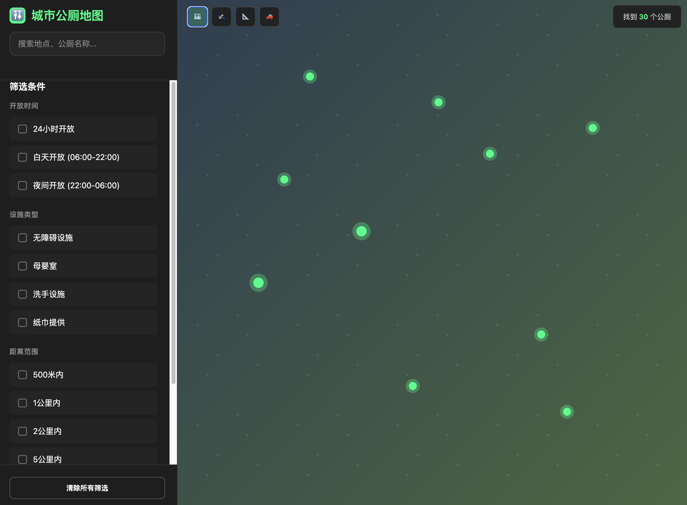
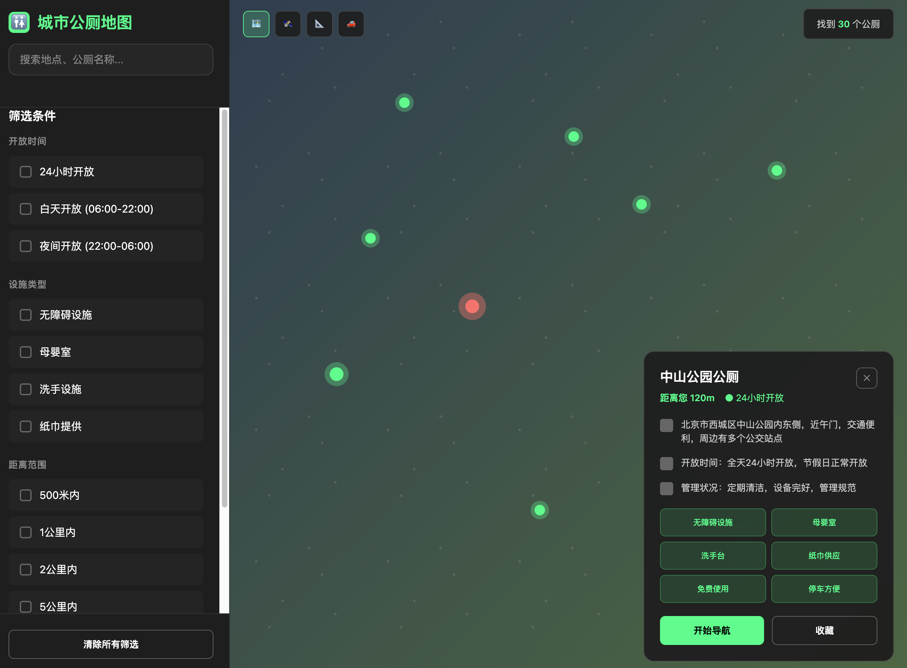
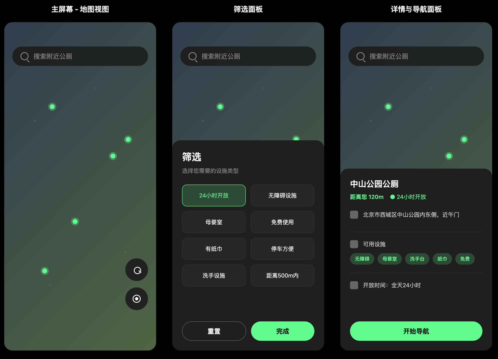

# 城市免费公共厕所地图 (Free Public Toilet Map)

一个全栈应用项目，旨在帮助市民和游客快速、高效地找到附近的免费公共厕所。项目包含一个后端API服务，以及支持 Web 和微信小程序两种访问方式的前端应用。

该项目从 0 到 1 完整地展示了现代应用开发的全过程，包括头脑风暴、UI设计、API规范定义、前后端开发与数据交互。

## 📸 应用截图 (Screenshots)

我们采用了一种独特、现代的 UI 风格，灵感来源于 Nike 的设计语言，强调动感、高效与高对比度。

| 主屏幕 (地图视图) | 详情与导航 | 筛选面板 |
| :---: | :---: | :---: |
|  |  |  |


## ✨ 主要功能 (Features)

* **实时地图展示**：在深色模式地图上清晰地展示附近的公共厕所位置。
* **自动定位与搜索**：自动获取用户当前位置，并动态加载2公里范围内的设施数据。
* **双端支持**：提供功能一致的 Web 应用和微信小程序，满足不同用户的使用习惯。
* **Nike 风格 UI**：独特的设计语言，提供极佳的视觉和交互体验。
* **RESTful API**：稳定、规范的后端接口，提供基于地理位置的查询服务。
* **数据导入**：支持从高德地图等第三方服务获取POI数据并导入数据库。

## 🛠️ 技术栈 (Tech Stack)

项目采用了前后端分离的架构，使用了以下现代化的技术栈：

#### **后端 (Backend)**
* **Node.js**: JavaScript 运行时环境。
* **Express**: 成熟、稳定的 Web 应用框架。
* **MongoDB**: 灵活的 NoSQL 数据库，尤其擅长处理地理空间数据。
* **Mongoose**: 优雅的 MongoDB 对象建模工具，用于规范化数据模型。
* **Dotenv**: 用于管理环境变量。

#### **前端 - Web 应用 (Frontend - Web)**
* **Next.js**: 强大的 React 框架，支持服务端渲染与静态站点生成。
* **React**: 用于构建用户界面的声明式 JavaScript 库。
* **TypeScript**: 为 JavaScript 添加类型安全。
* **SWR**: 用于数据请求的 React Hooks 库。
* **Tailwind CSS**: 功能优先的 CSS 框架，用于快速构建自定义 UI。
* **Leaflet**: 轻量级的开源交互式地图库。

#### **前端 - 微信小程序 (Frontend - Mini Program)**
* **Taro**: 开放式跨端跨框架解决方案，允许使用 React 语法开发小程序。
* **React** & **TypeScript**
* **SWR**

## 📂 项目结构

本项目采用 `monorepo` 的方式进行组织，将三个独立的子项目存放于同一仓库中。

```
/free-public-toilet-map
├── /haikou-toilet-api/        # 后端服务 (Node.js + Express)
├── /haikou-toilet-web/        # Web 前端 (Next.js)
└── /haikou-toilet-miniprogram/ # 微信小程序前端 (Taro)
```

## 🚀 快速开始 (Getting Started)

请按照以下步骤在你的本地环境中设置并运行本项目。

### 1. 克隆仓库
```bash
git clone [https://github.com/your-username/free-public-toilet-map.git](https://github.com/your-username/free-public-toilet-map.git)
cd free-public-toilet-map
```

### 2. 启动后端服务
```bash
# 进入后端项目目录
cd haikou-toilet-api

# 安装依赖
npm install

# 创建 .env 文件并配置
# 复制以下内容到 .env 文件中，并替换为你的 MongoDB Atlas 连接字符串
DB_URI=mongodb+srv://<username>:<password>@cluster0.xxxxx.mongodb.net/toilet-map?retryWrites=true&w=majority
PORT=5000

# (可选) 导入初始数据
# 将 haikou_toilets.json 文件放在此目录下，然后运行
node import-data.js

# 启动开发服务器
npm run dev
```
> 👉 后端服务将运行在 `http://localhost:5000`。

### 3. 启动 Web 前端
```bash
# 进入 Web 前端项目目录
cd ../haikou-toilet-web

# 安装依赖
npm install

# 创建 .env.local 文件并配置
# 复制以下内容到 .env.local 文件中
NEXT_PUBLIC_API_URL=http://localhost:5000/api/v1

# 启动开发服务器
npm run dev
```
> 👉 Web 应用将运行在 `http://localhost:3000`。

### 4. 启动微信小程序前端
```bash
# 进入小程序项目目录
cd ../haikou-toilet-miniprogram

# 安装依赖
npm install

# 编译并监听小程序项目
npm run dev:weapp

# 使用微信开发者工具
# 1. 打开微信开发者工具，选择“导入项目”。
# 2. 项目目录请选择本目录下的 `dist` 文件夹。
# 3. 填写你的 AppID 或使用测试号。
# 4. (关键一步) 在开发者工具的"详情"->"本地设置"中，勾选“不校验合法域名...”选项。
```

## 🗺️ API 接口文档

项目核心 API 如下：

* `GET /api/v1/toilets`：获取附近的厕所。
    * **Query Params**:
        * `longitude` (number, required): 用户经度。
        * `latitude` (number, required): 用户纬度。
        * `radius` (number, optional): 查询半径（米），默认2000。
        * `filters` (string, optional): 属性筛选，如 `filters=isOpen24h,isAccessible`。

## 未来路线图 (Roadmap)

* [ ] **用户评价系统**：允许用户对厕所的卫生、设施进行评分和评论。
* [ ] **用户上报功能**：允许用户提交新的厕所位置或纠正错误信息。
* [ ] **更丰富的筛选**：例如按是否有厕纸、是否需要排队等进行筛选。
* [ ] **管理员后台**：用于审核用户提交的数据。

## 协议 (License)

本项目采用 [MIT License](https://opensource.org/licenses/MIT) 授权。
